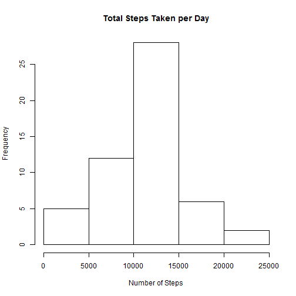
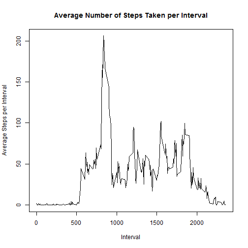
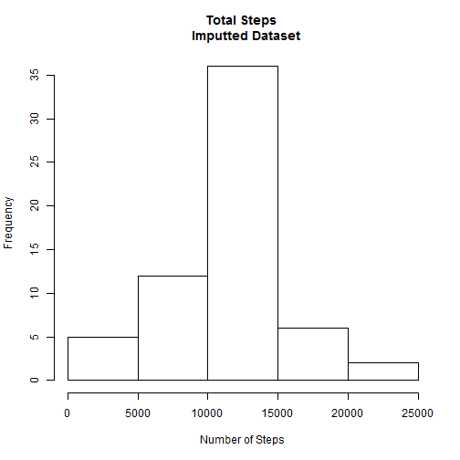
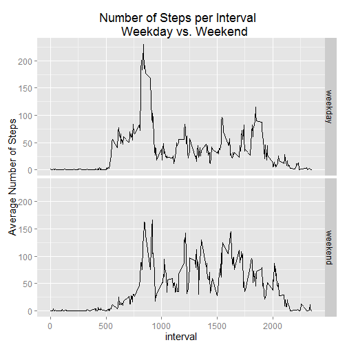

## Loading and preprocessing the data
I unzipped and read dataset activity.csv into R.


```r
unzip("activity.zip" ) 
dateDownload<-date()
data <- read.csv("activity.csv",header=TRUE)
```

## What is mean total number of steps taken per day?

```r
total_steps <- tapply(data$steps,data$date,sum)
hist(total_steps, main="Total Steps Taken per Day", xlab="Number of Steps")
```

 

Above is the distribution of the total number of steps taken per day. 


```r
mean_steps <- mean(total_steps,na.rm=TRUE)
median_steps <- median(total_steps,na.rm=TRUE)
```
The mean number of total steps taken: 10,766.19

The median number of total steps taken: 10,765

## What is the average daily activity pattern?


```r
plot(steps_by_interval, type="l",
     ylab="Average Steps per Interval",
     xlab="Interval",
     main="Average Number of Steps Taken per Interval")
```

 

This is a plot of the average number of steps taken per 5-minute interval.

```r
max_steps <-max(steps_by_interval$avg_steps)     
max_int <-steps_by_interval[which(steps_by_interval$avg_steps == max_steps),1]   
```

The maximum average steps during an interval is 206.17, and this occurs during interval 835.


## Imputing missing values

```r
step_miss <-sum(is.na(data$steps))
pct_miss <- mean(is.na(data$steps))
```

There are 2,304 records with missing values for the steps. This represents 13.11% of the records.

I imputed the values for the missing steps by using the mean for the similar interval period. 


```r
#imput missing values -using avg of 5 minute interval
na <- data[is.na(data$steps),]   #missing steps

#merging using datatable method 
na_DT <- data.table(na)
steps_by_interval_DT <- data.table(steps_by_interval)
setkey(na_DT,interval)
setkey(steps_by_interval_DT,interval)
data_miss_steps <-merge(na_DT,steps_by_interval_DT)
data_miss_steps[,steps:=NULL] #dropping steps column - all are NA
setnames(data_miss_steps,"avg_steps","steps") #renaming steps col

#delete records with NA steps from data then append imputed data on
data_noNA <- data[!is.na(data$steps),]
data_wimput <- rbind(data_noNA,data_miss_steps) #dataset to work with 
```


```r
#create histogram of total number of steps taken each day - new dataset
total_steps_imput <- tapply(data_wimput$steps,data_wimput$date,sum)
hist(total_steps_imput, main="Total Steps \n  Imputted Dataset", xlab="Number of Steps")
```

 

Here is a histogram of the number of steps using the imputted dataset.


```r
#mean and median of total steps - imputted dataset
mean_steps_imput<- mean(total_steps_imput,na.rm=TRUE)
median_steps_imput<- median(total_steps_imput,na.rm=TRUE)
```


The mean number of total steps taken: 10,766.19

The median number of total steps taken: 10,766.19

There is very little impact using the mean of the interval period to imput the missing steps values rather than just ignoring them. 

Mean with missing steps ignored - mean missing steps imputed: 0

Median with missing steps ignored - median missing steps imputed: -1.189


## Are there differences in activity patterns between weekdays and weekends?

```r
# taking date column, making it a date, taking the weekdays()
# putting, as a factor into weekpart
# then using levels() to assign it to either weekday or weekend
data_wimput$weekpart <-factor(weekdays(as.Date(data_wimput$date,"%Y-%m-%d")))
#add levels
levels(data_wimput$weekpart) <- list(
    weekday = c("Monday",
                "Tuesday",
                "Wednesday",
                "Thursday",
                "Friday"),
    weekend = c("Saturday",
                "Sunday")
)

#plot avg number of steps taken across all days by weekday vs. weekend
steps_by_interval_weekend <- data_wimput %>%
                           group_by(weekpart,interval) %>%
                           summarize(avg_steps=mean(steps, na.rm=TRUE))%>%
                           arrange(weekpart,interval)

#plot number of steps per interval- weekday vs. weekend
qplot(interval,avg_steps, data=steps_by_interval_weekend, 
      geom=c("line"),type="l",facets=weekpart~.) + 
      ylab("Average Number of Steps") +
      theme_set(theme_gray(base_size = 15)) +
      ggtitle("Number of Steps per Interval  \n  Weekday vs. Weekend") 
```

 

Looking at the above graph you can see that this individual took more steps on average during the weekends than during the weekdays.  


```r
weekend_weekday <- data_wimput %>%
    group_by(weekpart) %>%
    summarize(avg_steps=mean(steps, na.rm=TRUE),
              median=median(steps,na.rm=TRUE))%>%
    arrange(weekpart)
weekend_weekday
```

```
## Source: local data table [2 x 3]
## 
##   weekpart avg_steps median
## 1  weekday  35.61058      0
## 2  weekend  42.36640      0
```
